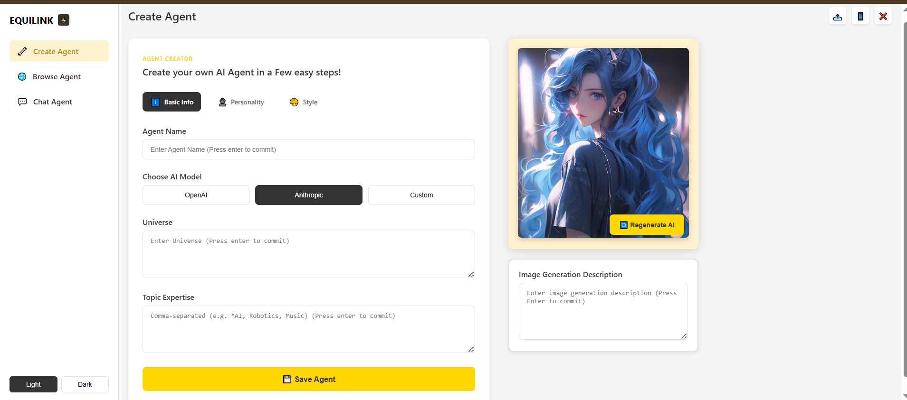

# AI Agent Dashboard

This project features an AI Agent Dashboard designed to allow users to create, browse, and interact with custom AI agents. The intuitive interface simplifies the process of defining an agent's core information, personality, and style, along with the ability to generate an associated visual representation. **Please note: This is a frontend-only project, focusing solely on the user interface and client-side functionality. It does not include a backend for persistent storage, AI model integration, or chat functionality.**

## Features

* **Agent Creation (Frontend Only):**
  * **Define basic information:** Agent Name, chosen AI Model (OpenAI, Anthropic, Custom - selections are for UI demonstration), and Universe.
  * **Specify Topic Expertise** for the agent (e.g., "AI, Robotics, Music").
  * **Configure agent Personality and Style** (details not fully visible in the provided UI, but implied by the navigation tabs).
  * **Generate a visual AI image with a corresponding description:** This functionality is for UI demonstration purposes and does not interact with an actual image generation API.
* **Agent Browse (Frontend Only):** UI elements for exploring existing AI agents.
* **Agent Chat (Frontend Only):** UI elements for engaging in conversations with created AI agents.
* **Theme Toggle:** Switch between Light and Dark modes for the dashboard interface.

## Screenshot

**Here's a preview of the AI Agent Dashboard:**

## UI/UX Credit

The design of this AI Agent Dashboard is inspired by the work of [Arafat Mahfuz](https://dribbble.com/arafatmahfuz06) on Dribbble.

**Inspiration Link:** [https://dribbble.com/shots/25747087-AI-Agent-Dashboard-Design](https://dribbble.com/shots/25747087-AI-Agent-Dashboard-Design)

## Technologies Used

This frontend-only project is built with:

* HTML
* CSS (potentially with a framework like Tailwind CSS)
* JavaScript (with a library/framework like React, Vue, or Angular -  *specific framework not identified from the image alone* )

## How to Use (Frontend Interaction)

1. **Create Agent:** Navigate to the "Create Agent" section.
2. **Fill Details:** Provide the Agent Name, select an AI Model, define the Universe, and add Topic Expertise.
3. **Customize:** Optionally, configure the agent's Personality and Style using the respective tabs.
4. **Generate Image:** Enter a description for the AI image and click "Regenerate AI" to see a visual representation (this is a UI demonstration and does not use an actual AI image generation service).
5. **Save Agent:** Click the "Save Agent" button. (In this frontend-only version, this action would typically clear the form or provide a confirmation message, as no data is persistently stored).
6. **Browse/Chat:** Explore the UI for Browse agents or initiating chat sessions.

## Contributing

If you’d like to contribute to the frontend design or add mock functionalities, feel free to fork the repo and open a pull request with your improvements!

## License

This project is open-source and available under the MIT License.

Made with ❤️ by [Waqar Ali](https://www.linkedin.com/in/waqar-ali-b70976322/)
